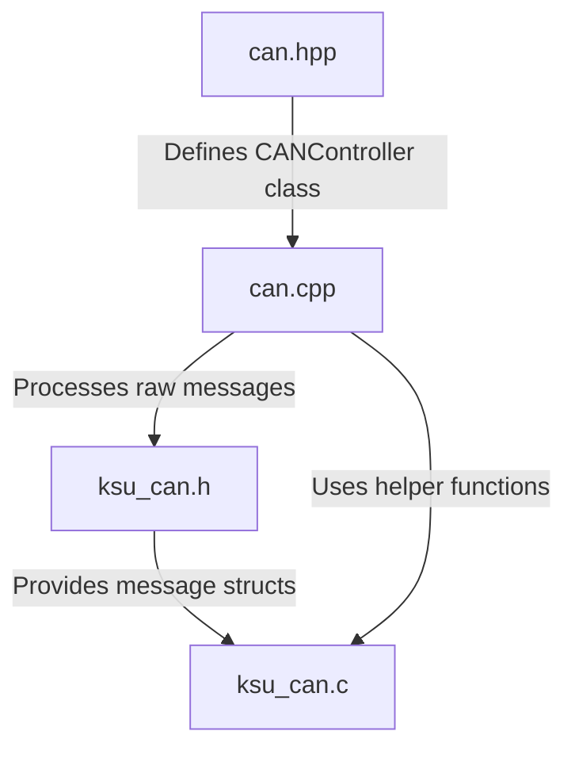

# WIP
Just trying to get this done before components start getting in, will update with more meaningful info later

# Project structure

## include
- **`8CU.hpp`**
  - This just provides all the defines related to this specific board

- **`adc.hpp`**
  - Handles setting up and reading the ADC values

- **`can.hpp`**  
  - Declares the `canMan` class and its public interface for interacting with the CAN controllers.
  
- **`ksu_can.h`**  
  - Provides the structure definitions for CAN messages.

- **`led.hpp`**
  - Gives basic neopixel/debug light setup and control

- **`main.hpp`**
  - Ties everything together with maybe some additional defines for general features like extra debug prints

## src
  
- **`can.cpp`**  
  - Implements the logic defined in `can.hpp`.
  - Reads raw CAN messages and processes them into structured data formats using the definitions from `ksu_can.h` and `ksu_can.c`.
  
- **`ksu_can.c`**  
  - Implements helper functions for parsing, encoding, and other utilities for CAN message handling.

- **`main.cpp`**
  - Executes everything and provides a high level overview of what the board does

---

# Overview

